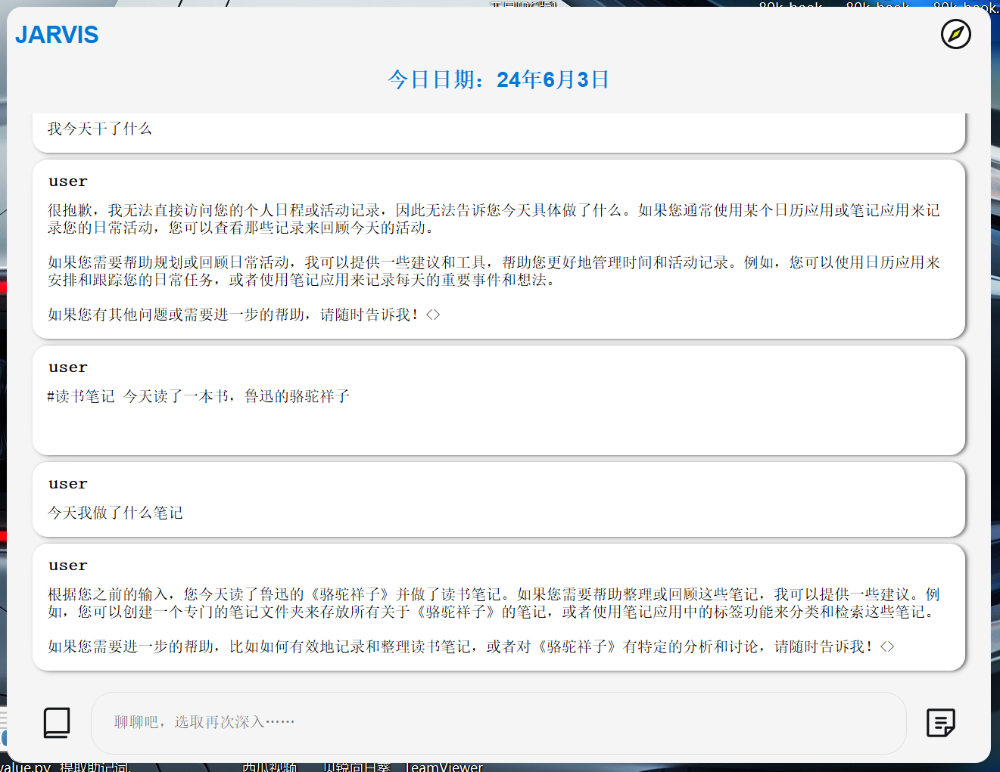
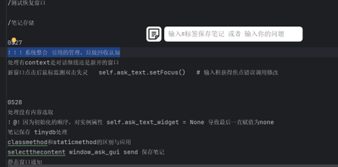
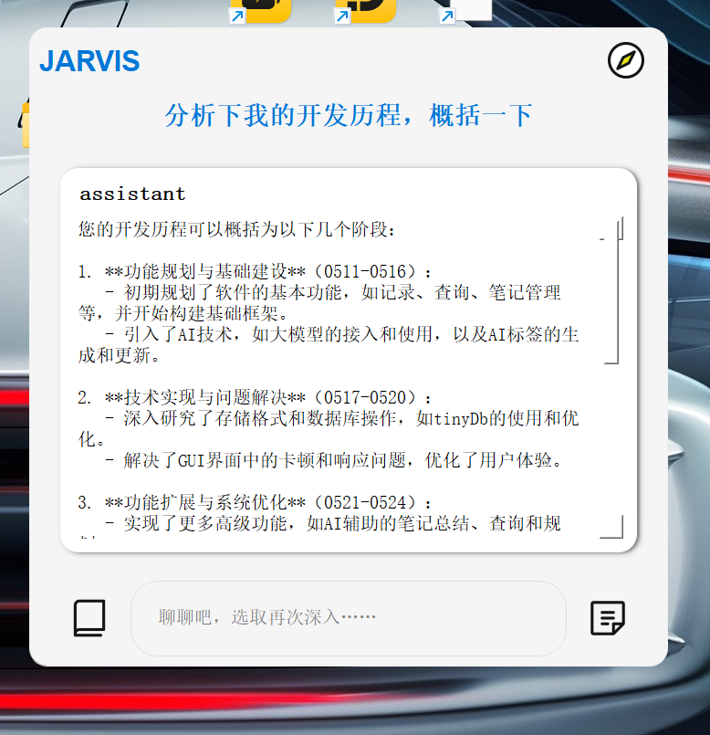
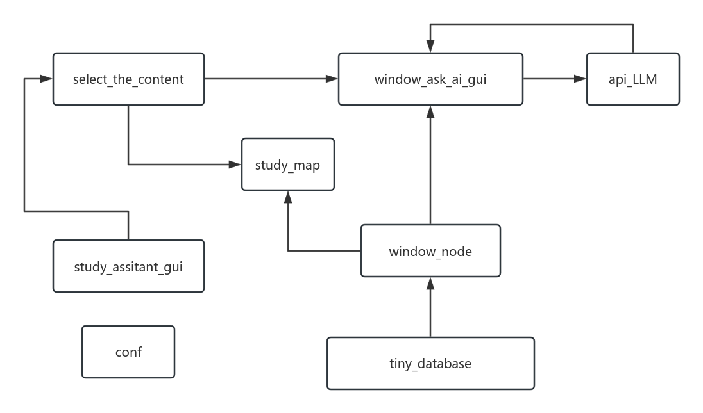
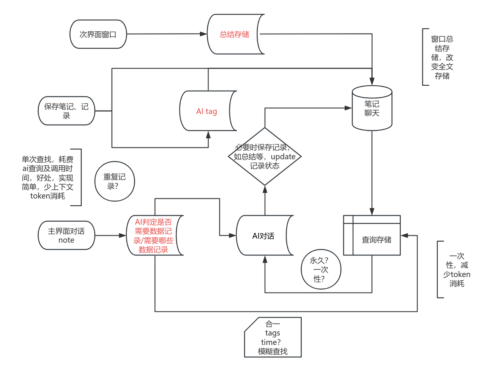

# askanywhere
# 一个划词ai助手，支持横向深入提问，在结果之上可再次选取，并在新窗口提问新问题，不影响原本问答流程。
初次使用：运行会产生一个config txt文件，按照说明配置deepseek api即可使用

## 使用说明：
### 划词
-在能选中的文字上划词即可弹出悬浮条，点击ALt直接提问，或者在文本框中输入相关内容后提问。
-回复在新的悬浮窗口中展示，可以进一步沟通，也可以对于新的疑问点划词打开新窗口沟通，不影响之前的问答。
### 笔记
-在任何输入框中输入#标签1 #标签2 可以记录笔记
### 存储调用
-根据标签，时间，模糊词，调用已经存储的记录
### 暂停划词
-系统托盘，右键，可以暂停、恢复、退出功能

## 关于主窗口
主窗口默认提供记忆调取，所以回复相对较慢，日常提问建议使用划词提问。
在主窗口可以沟通询问，总结近期活动，询问日程安排等等。
默认每次打开会总结上一天内容，此时询问可能得不到准确答复。

### 主窗口界面

### 划词查询

### 查询结果

### 模块框架

### 逻辑框架

